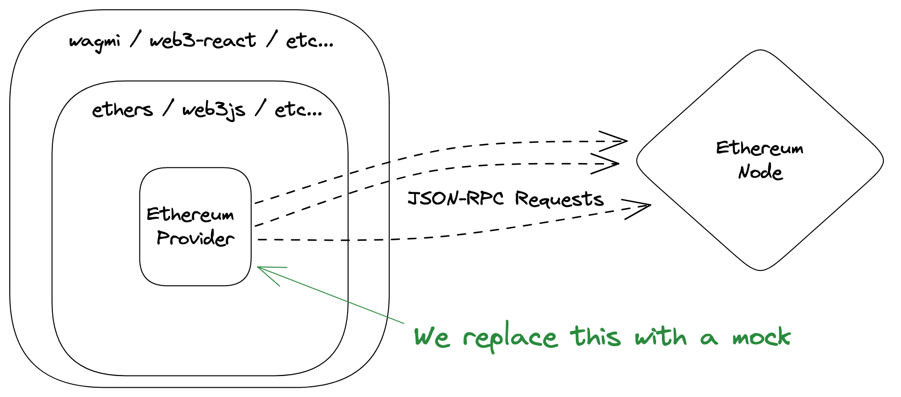

# Eth Testing

**A set of tools in order to generate a mock Ethereum Provider and simulate blockchain interactions in tests**

## Table of Contents

<!-- START doctoc generated TOC please keep comment here to allow auto update -->
<!-- DON'T EDIT THIS SECTION, INSTEAD RE-RUN doctoc TO UPDATE -->

- [The problem](#the-problem)
- [The solution](#the-solution)
- [Installation](#installation)
- [Examples](#examples)
  - [Basic example](#basic-example)
  - [More examples](#more-examples)
  - [Almost Real World Application](#almost-real-world-application)
- [Usage and API description](#usage-and-api-description)
  - [High levels mocks](#high-levels-mocks)
  - [Testing contract interactions](#testing-contract-interactions)
  - [Low levels mocks](#low-levels-mocks)
  - [Mocking values using functions](#mocking-values-using-functions)
  - [Mock options](#mock-options)
  - [Verbose mode](#verbose-mode)
- [Contributing :rocket:](#contributing-rocket)
- [LICENSE](#license)

<!-- END doctoc generated TOC please keep comment here to allow auto update -->

## The problem

Testing application with blockchain interaction is complex. Very often, codebases use powerful wrapper libraries such as [ethers](https://docs.ethers.io/v5/) or [web3js](https://web3js.readthedocs.io/en/v1.8.0/) in order to abstract away the interactions with Ethereum node.

However, dealing with these libraries when testing the application is a hard task and may be painful. Time is spent on understanding the implementation details of the library and developing an appropriate mock for it. Most importantly, it prevents us on writing [meaningful tests](https://twitter.com/kentcdodds/status/977018512689455106) for the application.

## The solution

Most of the popular libraries rely on the same core object, the [Ethereum provider](https://eips.ethereum.org/EIPS/eip-1193). It is the object in charge of interacting with the configured Ethereum node. `Eth Testing` is a simple solution to generate a mock Ethereum provider and associated utilities in order to properly simulate your blockchain state.



Because the mocking happens at the level of the JSON-RPC requests, the core functionnalities of this package do not make any assumptions on what other libraries or packages are used in order to interact with the blockchain.

In this spirit, this package tries at best to expose testing utilitaries that are not tied to an external library.

## Installation

The recommended way to use Eth-Testing with an application is to install it a development dependency:

Using `npm`
```console
npm install eth-testing --save-dev
```
Or using `yarn`
```console
yarn add eth-testing --dev
```
## Examples

### Basic example

As a basic example, let us consider a React app using [metamask-react](https://github.com/VGLoic/metamask-react) for handling MetaMask and tested using [React Testing Library](https://testing-library.com/docs/react-testing-library/intro).
```ts
// App.tsx
function App() {
    const { status, connect, account, chainId } = useMetaMask();

    if (status !== "connected") return <button onClick={connect}>Connect</button>

    return <div>Connected account {account} on chain ID {chainId}</div>
}

// app.test.tsx
import { generateTestingUtils } from "eth-testing";
import { render, screen, waitForElementToBeRemoved } from "@testing-library/react";
import userEvent from "@testing-library/user-event";
import App from "App";
...
describe("app connection", () => {
    const testingUtils = generateTestingUtils({ providerType: "MetaMask" });
    beforeAll(() => {
        // Manually inject the mocked provider in the window as MetaMask does
        global.window.ethereum = testingUtils.getProvider();
    })
    afterEach(() => {
        // Clear all mocks between tests
        testingUtils.clearAllMocks();
    })
    test("a user should be able to connect using MetaMask", async () => {
        // Start with not connected wallet
        testingUtils.mockNotConnectedWallet();
        // Mock the connection request of MetaMask
        testingUtils.mockRequestAccounts(["0xf61B443A155b07D2b2cAeA2d99715dC84E839EEf"]);

        render(<App />);
        const connectButton = await screen.findByRole("button", { name: /connect/i });
        // Click on the button
        userEvent.click(connectButton);

        await waitForElementToBeRemoved(connectButton);

        expect(screen.getByText(/connected account 0xf61B443A155b07D2b2cAeA2d99715dC84E839EEf on chain id 0x1/)).toBeInTheDocument();
    });
    test("a connected user should be able to see the wallet informations", async () => {
        // Start with a connected wallet - MetaMask React will automatically connect the user wallet
        testingUtils.mockConnectedWallet(["0xf61B443A155b07D2b2cAeA2d99715dC84E839EEf"]);

        render(<App />);

        await screen.findByText(/connected account 0xf61B443A155b07D2b2cAeA2d99715dC84E839EEf on chain id 0x1/);
    });
})
```

### More examples

As a next step, multiple examples of a simple React components with contract interactions are available in the `examples/react-apps` folder. It uses `jest` and `@testing-library` for the tests. 

Available examples include
- MetaMask connection,
- Wallet Connect connection,
- [Web3-React](https://github.com/Uniswap/web3-react),
- [Wagmi](https://wagmi.sh/docs/getting-started),
- Contract interactions with `ethers` and `web3js`: call, transaction, events,
- ENS name and address resolutions

A fully tested simple Node script is also available in the `examples/node-app` folder. It uses `jest` for the tests.

### Almost Real World Application

For a more serious application with more complete features and tests, one can take a look at the [Rainbow Token application](https://github.com/VGLoic/rainbow-token-frontend).

## Usage and API description

The first step is to generate the utils
```ts
const testingUtils = generateTestingUtils({ providerType: "MetaMask" });
```
The argument is only the provider type, the three choices for now are `"MetaMask"`, `Coinbase`, `"WalletConnect"` or `"default"`.

The provider will then need to be injected in the application, this mechanism depends on the implementation details of the application. As an example for MetaMask, provider is injected in the `window` object so as an example, using `jest` hooks one may inject the mock provider as
```ts
// This only works if the goal is to mock the MetaMask provider
beforeAll(() => {
    global.window.ethereum = testingUtils.getProvider();
});
```

It is strongly advised to clean the mocks between each tests, this may be done using the `clearAllMocks` function exposed through the `testingUtils` object. Again, using `jest` hooks, this can be done as
```ts
afterEach(() => {
    testingUtils.clearAllMocks();
});
```

### High levels mocks

High level mocking functions allows anyone, even without a knowledge of the underlying mechanics to properly mock the interactions with the provider/blockchain. This is the advised way to perform mocking.

The main functions are described below:
- `mockReadonlyProvider`: allows to mock the chain ID / network and the block number, the accounts are mocked to an empty array. This is the ideal mock when the provider is not associated to a wallet, e.g. a provider based on Infura or Alchemy node URL.
```ts
// The chain ID and block number can be set in the options
// They default to "0x1" (Ethereum main net) and the block number to "0x1"
testingUtils.mockReadonlyProvider(options);
```
- `mockNotConnectedWallet`: allows to mock the accounts as an empty array,
```ts
testingUtils.mockNotConnectedWallet(options);
```
- `mockConnectedWallet`: allows to mock the connected accounts, the chain ID / network and the block number,
```ts
// The chain ID and block number can be set in the options
// They default to "0x1" (Ethereum main net) and the block number to "0x1"
testingUtils.mockConnectedWallet(["0xf61B443A155b07D2b2cAeA2d99715dC84E839EEf"], options);
```
- `mockBalance`: allows to mock the balance of an account
```ts
// Mock balance of 0xf61B443A155b07D2b2cAeA2d99715dC84E839EEf to 1 ether
testingUtils.mockBalance("0xf61B443A155b07D2b2cAeA2d99715dC84E839EEf", "0xde0b6b3a7640000");
```
- `mockChainId`: allows to mock the chain ID / network to which the provider is connected
```ts
// Mock the network to Ethereum main net
testingUtils.mockChainId("0x1");
```
- `mockBlockNumber`: allows to mock the block number
```ts
// Mock the network to Ethereum main net
testingUtils.mockBlockNumber("0x1");
```
- `mockAccounts`: allows to mock the accounts with which the provider is connected
```ts
// Mock the connected account as 0x138071e4e810f34265bd833be9c5dd96f01bd8a5
testingUtils.mockAccounts(["0x138071e4e810f34265bd833be9c5dd96f01bd8a5"]);
```
- `mockChainChanged`: allows to simulate a change in the chain ID / network
```ts
// Simulate a change to the Ropsten network
testingUtils.mockChainChanged("0x3");
```
- `mockAccountsChanged`: allows to simulate a change in the chain ID / network
```ts
// Simulate a change of account to 0xf61B443A155b07D2b2cAeA2d99715dC84E839EEf
testingUtils.mockAccountsChanged(["0xf61B443A155b07D2b2cAeA2d99715dC84E839EEf"]);
```
- `mockRequestAccounts`: this is a special utils created in the case of MetaMask, it allows to mock the connection request. The accounts will automatically be mocked to the input value once the connection has been simulated.
```ts
// Mock the next request to eth_requestAccounts as 0x138071e4e810f34265bd833be9c5dd96f01bd8a5
testingUtils.mockRequestAccounts(["0xf61B443A155b07D2b2cAeA2d99715dC84E839EEf"]);
```

### Testing contract interactions

Most of the application interacts with deployed contracts, interactions are generally more complex with contracts, hence a dedicated object has been created for it.

The testing utils expose a `generateContractUtils` method, it allows to generate high level utils for contract interactions based on their ABI.

It is advised to *freeze* the ABI using `as const` [feature](https://www.typescriptlang.org/docs/handbook/typescript-in-5-minutes-func.html#readonly-and-const) of TypeScript. By doing so, types will be generated for event and method names when using the contract testing utils. Refer to [ABIType](https://github.com/wagmi-dev/abitype) for additional informations.
```ts
const abi = [...] as const;
// An address may be optionally given as second argument, advised in case of multiple similar contracts
const contractTestingUtils = testingUtils.generateContractUtils(abi);
```

Let us consider a very simple contract
```Solidity
contract Storage {
    uint public value;

    event ValueUpdated(uint value);

    constructor() {
        emit ValueUpdated(0);
    }

    function setValue(uint newValue) public {
        value = newValue;
        emit ValueUpdated(newValue);
    }
}
```

These utils expose multiple functions
- `mockCall`: allows to mock the result of a call to a contract using the name of the function to be called and the orderered list of values to be returned
```ts
// Mock a call to the "value" function of the contract and returning the uint 100
contractTestingUtils.mockCall("value", ["100"]);
```
- `mockTransaction`: allows to mock the result of a transaction from a contract method using the name of the function to be called
```ts
// Mock a transaction based from the `setValue` function of the contract
contractTestingUtils.mockTransaction("setValue");
```
- `mockGetLogs`: allows to mock the next retrieval of the logs for a particular event type
```ts
// Two events will be retrieved with value "0" and "12"
contractTestingUtils.mockGetLogs("ValueUpdated", [["0"], ["12"]]);
```
- `mockEmitLog`: allows to mock the emission of a a log for a particular event type. :warning: there is a difference of usage between `web3.js` and `ethers`
```ts
// With ethers
contractTestingUtils.mockEmitLog("ValueUpdated", ["13"]);
// With web3.js
// Needs to be done before the test or before the subcription happens
testingUtils.mockSubscribe("0x123");
...
contractTestingUtils.mockEmitLog("ValueUpdated", ["13"], "0x123");
```
### Low levels mocks

These functions handles mock at a lower level, use it if you are confident with JSON-RPC requests.
- `emit`: emits a notification for the provider, associated subscribers will be triggered
```ts
// Simulate a change of account to 0xf61B443A155b07D2b2cAeA2d99715dC84E839EEf
testingUtils.lowLevel.emit("accountsChanged", ["0xf61B443A155b07D2b2cAeA2d99715dC84E839EEf"]);
```
- `mockRequest`: registers a mock for a JSON-RPC request
```ts
// Simulate 0x138071e4e810f34265bd833be9c5dd96f01bd8a5 as connected account
testingUtils.lowLevel.mockRequest("eth_accounts", ["0xf61B443A155b07D2b2cAeA2d99715dC84E839EEf"]);
```

### Mocking values using functions

A part of the mocking utilities allow to use functions returning or resolving the mocked values instead of directly specifying the mocked values. This functional form allows for arbitrary logic to run before returning the mocked values. It allows in particular to dynamically handle the mocked values based on the params or defer the response.

```ts
// Example extracted from #61 for deferred responses
const mockContract = mockWalletConnect.generateContractUtils(ContractABI, CONTRACT_ADDRESS);
const myFunctionDelay = new Deferred();
mockContract.mockCall('someFunction', async (params: [callPayload: TransactionCallPayload, blockTag: string]) => {
    await myFunctionDelay.promise;
    return ["Example return value"]
});

// Later, cause the system under test to make the contract call
// Then assert the in-progress state is correct
// Finally, trigger the smart contract function to complete
myFunctionDelay.resolve();
```

At the moment of writing, only the `mockCall` and the low level utils allow for functional mocking.

### Mock options

Some methods allows to specify the mock options, or part of the mock options.

```ts
type MockCondition = (params: unknown[]) => boolean;

type MockOptions = {
  // If true, the mock will not be cleared after being used 
  persistent?: boolean;
  // If true, the request will throw, the data field will be used as error
  shouldThrow?: boolean;
  // Timeout in milliseconds for the resolve or the reject
  timeout?: number;
  // Condition for the mock to be triggered
  condition?: MockCondition;
  // Callback that is triggered once the mock has been used, it is particularly useful when mocks needs to be triggered after certain user actions, like a transaction or a wallet connection
  triggerCallback?: (data?: unknown, params?: unknown[]) => void
};
```

### Verbose mode

It is sometimes handy to display which JSON-RPC requests are triggered and for each, show the associated mock if it exists. For that, the setup function allows to set the utils in *verbose* mode
```ts
// Log all requests
const testingUtils = generateTestingUtils({ verbose: true });
...
// Do not log mocked requests
const testingUtils = generateTestingUtils({ verbose: { dismissMocked: true } });
...
// Do not log not mocked requests
const testingUtils = generateTestingUtils({ verbose: { dismissNotMocked: true } });
...
// Do not log not mocked requests
const testingUtils = generateTestingUtils({ verbose: { dismissNotMocked: true } });
...
// Log only requests for particular method and dismiss the mocked ones
const testingUtils = generateTestingUtils({ verbose: { methods: ["eth_getLogs"], dismissMocked: true } });
```
## Contributing :rocket:

Contributions are welcome! Please follow the guidelines in the [contributing document](/CONTRIBUTING.md).

## LICENSE

[MIT](LICENSE)
